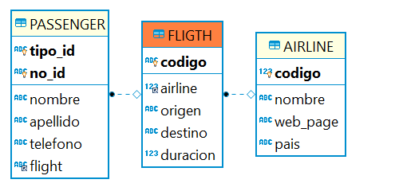

searchCommentsByBlogTitle## Escuela Colombiana de Ingeniería

### CVDS – Ciclos de vida del desarrollo de Software
### Parcial Segundo Tercio


**IMPORTANTE**

* Se puede consultar en la Web: APIs/Documentación de lenguaje y frameworks (Primefaces, Guice, MyBatis, etc), y enunciados de los laboratorios (se pueden revisar los fuentes incluidos con los dichos enunciados).
* No se permite: Usar memorias USB, acceder a redes sociales, clientes de correo, o sistemas de almacenamiento en la nube (Google Drive, DropBox, etc). El uso de éstos implicará anulación.
* El filtrado y ordenamiento de los datos DEBE realizarse en el motor de base de datos, a través del uso de SQL. Consultar todos los datos y filtrarlos en el servidor de aplicaciones -que es supremamente INEFICIENTE- se evaluará como INCORRECTO.


Se le han dado los fuentes de un avance parcial de una plataforma de vuelos. En esta plataforma los usuarios consultar las aerolineas y los vuelos con los que cada una cuenta.
Adicionalmente se permite adicionar nuevos pasajeros a los vuelos existentes.

Para el Sprint en curso, se han seleccionado las siguientes historias de usuario del Backlog de producto:

Recuerde que en el formato XML no se puede utilizar '<' y '>', por ejemplo al realizar comparaciones, 
 utilice '&amp;lt;' o '&amp;gt;' respectivamente. 

## Historia de usuario #1

  > **Como** Usuario del sistema de vuelos
  >
  > **Quiero** Poder consultar los pasajeros registrados a un vuelo.
  >
  > **Para** Poder validar el nivel de ocupación del vuelo y saber si se puede adicionar un pasajero más.
  >
  > **Criterio de aceptación:** Se debe mostrar el tipo y numer de identificación del pasajero, así como su nombre, apellido y telefono.


## Historia de usuario #2

  > **Como** Usuario de la plataforma
  >
  > **Quiero** Consultar los vuelos existentes cuyo origen o destino contienen el texto ingresado en el filtro.
  >
  > **Para** Conocer los vuelos que cumplen con mis necesidad de viaje..
  >
  > **Criterio de aceptación:** El reporte NO debe requerir entrar parámetro alguno. La coincidencia del texto no debe ser completa, si se busca BOG, deberían aparecer los vuelos cuyo origen o destino es Bogotá. Los vuelos deben estar organizados por la duración del vuelo de forma descendente.

# Modelo 

El modelo de base de datos asociados a la implementación parcial es el siguiente:



A partir de la aplicación base suministrada, debe realizar lo siguiente:

1.  (20%) A partir de la especificación hecha en los métodos
    `listPassengerByFligth` y `listFligthByPlace` de la fachada de
    servicios (la parte lógica de la aplicación), implemente sólo una prueba (la que considere más importante para validar las especificaciones y los criterios de aceptación). Siga el esquema usado en `FligthServicesTest` para poblar la base de datos volátil y verificar el comportamiento de las operaciones de la lógica.

2.  (40%) Implemente la historia de usuario #1, agregando todo lo que haga falta en la capa de presentación, lógica y de persistencia. La vista debe implementarse en `fligth.xhtml`.

3.  (40%)Implemente la historia de usuario #2, agregando todo lo que haga falta en la capa de presentación, lógica y de persistencia. La vista debe implementarse en `searchFligth.xhtml`.


## Entrega

Siga al pie de la letra estas indicaciones para la entrega del examen. EL HACER CASO OMISO DE ESTAS INSTRUCCIONES PENALIZARÁ LA NOTA.

1. Limpie el proyecto

	```bash
	$ mvn clean
	```

1. Configure su usuario de GIT

	```bash
	$ git config --global user.name "Juan Perez"
	$ git config --global user.email juan.perez@escuelaing.edu.co
	```

2. Desde el directorio raíz (donde está este archivo README.md), haga commit de lo realizado.

	```bash
	$ git add .
	$ git commit -m "entrega parcial - Juan Perez"
	```


3. Desde este mismo directorio, comprima todo con: (no olvide el punto al final en la segunda instrucción)

	```bash
	$ zip -r APELLIDO.NOMBRE.zip .
	```

4. Abra el archivo ZIP creado, y rectifique que contenga lo desarrollado.

5. Suba el archivo antes creado (APELLIDO.NOMBRE.zip) en el espacio de moodle correspondiente.

6. IMPORTANTE!. Conserve una copia de la carpeta y del archivo .ZIP.


<!-- ## Bono 
Si después de realizado el parcial, de forma INDIVIDUAL encuentra defectos menores (que impliquen a lo sumo cambiar 5 líneas de código), y que al corregirlos permiten que los puntos 2 o 3 funcionen:
1. Haga los ajustes en su código.
2. Haga un nuevo commit con el mensaje "entrega bono, ahora funciona el Punto XX" , donde XX es el punto que se corrigió. 
3. Ejecute:

    ```bash
	    $ git diff --stat HEAD HEAD^^
    ```

4. Si el resultado del comando anterior es menor o igual a 10, puede aplicar al bono.
5. Comprima la nueva versión siguiendo el esquema indicado en el parcial, y súbalo a más tardar el 24 de Octubre a las 11:59pm en el espacio correspondiente.
-->
